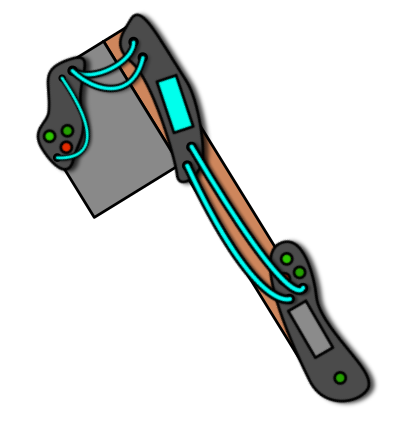

# Primitier Modding Framework (PMF)

Primitier Modding Framework (PMF) is a framework to help make mods for Primitier.
It uses [MelonLoader](https://github.com/LavaGang/MelonLoader).
It adds helper classes to make mods for Primitier.

## Downloading a mod
[Downloading mods](Documentation/DownloadingMods.md)

## Creating a mod
[Creating mods](Documentation/CreatingMods/CreatingMods.md)

